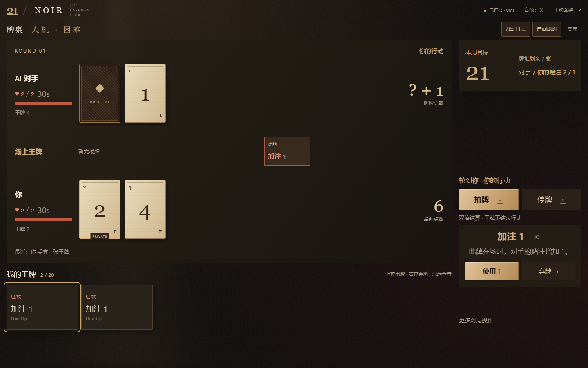

# Noir 浏览器版

这是独立的 `404elf/RE7_21_Noir_Web` 浏览器项目，游戏机制基于桌面版 `404elf/RE7_21_Noir` v1.5.3（`7b921cb`），Web 功能迁自其开发分支 `4687f96`。两个浏览器通过房间码或邀请链接入座，双方准备后，可使用全部原有王牌并打完整场。原桌面项目独立维护，不包含在本仓库；来源与同步方式见 [UPSTREAM.md](../UPSTREAM.md)。



界面以原桌面版的固定分区为基准：左侧依次为对手、场上王牌和自己，下方保留六张一页的手中王牌；右侧分别显示目标／牌堆、双人计时器、赌注、抽牌／停牌和求和／投降。场上王牌合并排列并标明归属，空间不足时分页。数字牌左对齐，点数固定在牌区右侧；空场牌区保留紧凑位置，避免出牌后整桌跳动。选牌后在右侧直接显示完整效果说明，按内容占空间；手机按相同顺序压缩，操作紧接牌桌下方，效果说明按需弹出。大厅、牌桌和配置文字不会误选，输入框仍可正常编辑；日志按需打开。保留暖棕与红铜色、纸张纹理、立体牌背及本地动画/音效，没有外部字体、素材 CDN 或前端构建步骤。

鼠标上拉约 32 像素即可出牌，向右约 48 像素即可弃牌；触屏分别为 36 / 56 像素。无需拖进远处投放区，斜向、向左和向下移动不会执行操作；松手时再次检查状态版本与行动权限。键盘聚焦王牌后，↑ 出牌、→ 弃牌；H 抽牌、S 停牌。点选场上王牌可查看效果；点空白处或 Esc 收起说明。Web 取消固定的 0.5 秒操作间隔，保留行动权、封锁、修订号检查、每连接每秒 20 帧限制与一次只提交一个操作；收到确认后可立即继续。共享 Match 默认仍保持桌面版间隔。右上角音效默认关闭，并遵循系统的减少动态效果设置。

动效保持现有布局：抽牌从第一帧显示完整点数，120 毫秒内落牌；出牌、目标变化、赌注、生命与结算使用局部短反馈，整桌不闪屏。动画不阻塞输入、不增加行动等待，刷新／重连的状态快照不重播历史动作。开启系统「减少动态效果」会停用动作动画，并立即清理已播放的反馈。

音效由浏览器本地 Web Audio 合成轻声纸牌、停牌、王牌、回合及结算声，不请求音频素材或增加网络流量。初次默认关闭；开启后按本站路径记住选择，刷新仍需一次真实点击／按键来解锁浏览器音频。关闭音效立即停止声音，切到后台停止声音和粒子；回到前台后下次操作恢复，不补播后台事件。自己正在计时并跨过 10 秒、3 秒时各提示一次，不持续滴答。

## 本地运行

需要 Python 3.12+。Web 服务不需要 Pygame、Node.js、组网软件或数据库。

```powershell
python -m venv .venv-web
.\.venv-web\Scripts\python -m pip install -r requirements-web.txt
.\.venv-web\Scripts\python -m uvicorn web.app:app --host 127.0.0.1 --port 8000 --workers 1 --ws-max-size 2048 --ws-max-queue 8
```

macOS / Linux 使用 `.venv-web/bin/python` 替换上面的 Python 路径。打开 <http://127.0.0.1:8000>，输入昵称后建房；另一浏览器输入房间码，或打开邀请链接后点击加入。邀请链接不包含席位凭证。双方点击「我准备好了」开始。

房主是第一个座位，可在建房前或等待阶段设置本房间规则；服务器验证并保存配置、判断操作与计时。默认采用服务器配置，不会自动读取玩家电脑上的文件。在同一页面刷新可重连；使用两个浏览器、两个独立隐私窗口或两个独立标签页测试两个座位。同一标签页的席位凭证保存在 `sessionStorage`；复制含有当前会话的标签页可能复制凭证，此时会拒绝第二个连接。请从首页新开标签页。

仅在需要局域网测试时，把监听地址改为 `0.0.0.0`，双方使用服务器的局域网 IP 访问；邀请链接使用当前地址，因此不要把 `localhost` 链接发送给另一台电脑。

## 人机对战

首页点击「人机对战」，选择原版入门／标准／困难／极难四档难度，以及赌徒／保守／摇摆型三种打法。极难与原版一样不区分打法。人机沿用当前自定义玩法和计时草稿；AI 已准备，玩家确认房间规则后即可开局。刷新保留座位与牌局，再战由 AI 自动同意；求和按原版公开生命值判断接受或拒绝。

复用桌面源提交 `4687f96571718c6ffa10e6b4da95b9bbe49d8741` 的 `Strategy`、`Observation` 和 `tactics.Planner`，不使用原 TCP BotSession。AI 只能看到自己的牌、对手明牌、牌堆张数、公开场牌和公开动作，不能看到对手暗牌、手中王牌或实际牌堆顺序。每个房间有独立策略／随机数；最多两个独立进程同时计算、默认最多八个人机房间（包括等待／结束后尚未过期的房间），其余房间排队，双人网络房间的事件循环不被计算占用。Linux／Docker 上每次计算最多 2 秒，超预算合法停牌；Windows 无 POSIX 计算中断，复杂自定义配置可能耗时更久。每次动作重新检查房间版本、连接与行动权，断线暂停并丢弃过时计算结果。

服务器统一处理人机规则、计时和重连；人机也需要连接服务器，并非离线游戏。AI 自身的动作间隔约 0.25 秒，便于看清连续王牌；这不会给玩家加冷却。两人房间流程保持不变。

## 配置

- 默认复用根目录 `config.json` 的生命、牌堆范围、初始与奖励王牌、牌池权重及手牌/桌面上限。原有 JSON 注释字段和预设均可读取。
- 默认复用 `timer.json`：支持不计时、每次行动、每人每局额度、Fischer 整场加秒制、首次准备计时和结算等待。`null` 的不限时语义与桌面版一致。
- `timer.json` 的 `settlement_seconds` 优先控制亮牌时间；计时文件缺失时采用 `config.json` 的 `result_screen_duration`。
- `NOIR_CONFIG` / `NOIR_TIMER` 可指向服务端**默认配置**路径。默认配置在进程启动时读取，修改后重启；重启会清空内存房间。玩家自定义房间无需重启，不能指定服务端文件路径或改写默认文件。
- `NOIR_BASE_PATH` 配置公开路径：默认留空在网站根目录，也可设 `/re7` 或 `/games/noir`。不含域名、查询参数或 `..`；尾部斜线可省略。它会同时配置网页、素材、接口与 WebSocket 路径。
- `NOIR_ORIGIN` 可固定浏览器来源，例如 `https://game.404elf.dev`。仅填协议、域名和可选端口，不要添加 `/re7`。未设置时只接受与当前请求相同来源的浏览器连接；HTTPS 终止于代理时应显式设置。

首次尝试建议保留仓库默认规则。Web 不设固定操作间隔，收到服务器确认即可继续。两人连续停牌后结算；爆牌不会立即判负，仍可用王牌改变手牌/目标。双方都爆牌时点数较小者获胜。王牌的消耗条件、封锁和一次性效果清理都由原引擎处理。

### 玩家自定义房间

1. 首页可直接进入「游戏配置」或「计时设置」，按对局规则／王牌权重／计时设置切换。可选择基础版、平衡版、娱乐版、混沌版、资源版、地下室的盛宴、最后一根手指或烛火局，再按需编辑。预设只切换游戏规则，保留当前计时草稿。计时优先提供原版 1+0、2+1、3+0、3+2、5+0、5+3、10+0、10+5、15+10、30+0 和不限时；「自定义」直接进入独立参数页，返回预设保留草稿。
2. 可调整原版 10 项规则、42 种功能王牌的权重，以及所有原版计时参数。数字王牌固定为 2–7，由数字王牌概率控制；功能牌权重全部为 0 时仍遵循原版回退到数字牌池的行为。权重只表示相对抽取机会，不能定义新卡效果。
3. 「导入配置 JSON」接受原版 `config.json`、预设 JSON、`timer.json`，也接受 `{ "config": ..., "timer": ... }` 整套对象。支持 UTF-8 BOM、原有 `_comment_*`、`_name_*`、`_c_*` 说明和 `num_limit` 文字；服务端仅保留已知有效参数。`Return+` 对应游戏内的 `ADD2+`。可分别下载 `config.json` 与 `timer.json`，供桌面版或朋友导入。单份导入文件与配置请求上限 16 KiB。
4. 「用于新房间」应用到当前页面的建房草稿；点击创建后，服务器复制为房间独立配置。同一服务能同时运行不同规则、牌池和计时的房间。草稿没有永久保存到浏览器，刷新后恢复服务器默认；需要保留时导出 JSON。已创建房间的规则则随席位重连恢复。
5. 双方都能点击「查看完整规则」。房主在等待阶段可修改规则，保存会取消双方准备；过期版本的准备请求会被拒绝。双方按当前版本确认后开局，随后规则锁定，再战沿用同一配置；想换玩法请另建房间。

「随机生成」复用原版随机范围；「随机权重」仅调整功能牌权重（0/2/4/6/8/10）。每项旁的「锁」可保留该值，一键解除全部锁定。随机结果先经服务器验证，再作为未保存草稿展示。

「AI 配置文件」下载原版配置说明和当前房间模板。把这份文件及玩法要求交给你使用的聊天 AI，再导入其生成的 JSON；这不调用本站托管的 AI 服务，也不需要在本站填写 API 密钥。文件内说明了配置键、范围、牌池、计时和兼容格式。

计时参数中的 `null` 保留“不限时”含义；无效值会明确拒绝，不会悄悄钳制为其他值。亮牌等待使用 `timer.json` 的 `settlement_seconds`，即使关闭行动计时也生效。导入时保留的 `result_screen_duration` 仅作为缺少计时文件时的兼容默认。

`GET /api/settings` 返回默认值、预设和编辑范围；`POST /api/settings/validate` 校验配置；建房请求可带 `config` / `timer`。等待阶段 `POST /api/rooms/{code}/settings` 需要房主席位凭证和当前修订号。配置通过 HTTP 传输，不扩大现有 2 KiB WebSocket 操作限制；后续只在实际改规则时发送规则补丁。

## Docker 本地运行与未来部署

```sh
docker compose -p noir-web up --build -d
docker compose -p noir-web ps
docker compose -p noir-web logs --tail=50 game
docker compose -p noir-web down
```

访问 <http://127.0.0.1:8000>。默认只发布到本机回环地址；`config.json` 与 `timer.json` 只读挂载。容器以非 root 身份运行，根文件系统只读，健康检查入口为 `/healthz`。`NOIR_BIND` 与 `NOIR_PORT` 可调整本地监听地址和端口。

部署到 `https://game.404elf.dev/re7` 时，设置 `NOIR_BASE_PATH=/re7` 和 `NOIR_ORIGIN=https://game.404elf.dev`，让反向代理把 `/re7/` 请求原样转发到容器的 8000 端口，**保留 `/re7` 前缀，不做路径剥离，不再额外设置 Uvicorn `--root-path`**。应用将 `/re7?room=...` 相对跳转到 `/re7/?room=...`，避免 HTTPS 代理后的错误 HTTP 跳转。公开健康入口是 `/re7/healthz`，内部 Docker 探针仍用 `/healthz`。

可复制 [部署环境示例](../deploy/noir.env.example) 为仓库根目录 `.env`，然后使用普通 Docker Compose 命令。本地测试 `/re7` 时保留 `NOIR_ORIGIN` 为空即可；正式 HTTPS 配置见示例文件的注释。[Nginx 路径与 WebSocket 示例](../deploy/nginx-re7.conf.example) 仅是供审查的代理片段，未安装到任何服务器。WebSocket 需要显式转发 Upgrade / Connection 头；示例采用 75 秒读取超时，浏览器每 10 秒心跳。依据 [Nginx 官方文档](https://nginx.org/en/docs/http/websocket.html)。

**只运行一个 worker、一个副本。** 房间与计时在内存中；多 worker/副本会导致请求落到不同房间字典。本次不包含任何 Azure、Cloudflare、现有服务器、DNS 或生产环境变更。

### 上线准备与更换主域名

代码和 Docker 交付后，小规模公开试玩还需要三个部署步骤：

1. 选定主机，从本 Web 仓库以单 worker / 单副本运行镜像，明确正式游戏与计时配置。无需把 Web 代码合并到桌面仓库。默认不计时；需要防止长时间挂机可启用现有准备/行动计时。重启会丢失正在进行的房间，更新应避开进行中的牌局。
2. 为 `game.404elf.dev` 配置 DNS、HTTPS 证书与反向代理，使用上面的 `/re7` / Origin 配置并转发 WebSocket。按实际网络配置可信代理和真实客户端 IP 的限流：当前 Docker 默认不信任转发头，直接放在代理后会把所有玩家按代理 IP 合并限流。部署阶段必须先解决这一点；不能仅添加代理限流却保留后端共享计数。可使用 [受信代理 Compose 覆盖示例](../deploy/compose.proxy.example.yaml)，`NOIR_TRUSTED_PROXIES` 必须指定实际代理来源 IP/网段，不能照抄占位符或放行任意地址。代理应覆盖客户端提供的转发头，后端继续只向代理开放。
3. 在 HTTPS 的最终地址验收双浏览器完整对局、邀请、刷新、断网重连和后台恢复，验证实际移动浏览器；配置健康/错误监控和回滚镜像。64 个房间是保护上限，还没有做容量压测，首次上线应按小规模试玩安排。

以后把 `404elf.dev` 换成其他主域名，只需为新 `game.新主域名` 配置 DNS/证书/代理，并更新 `NOIR_ORIGIN`；保留 `/re7` 时无需改 `NOIR_BASE_PATH`，**无需修改前后端源码或重新构建镜像**。浏览器从当前模块地址生成所有请求、WebSocket 和邀请链接，不依赖原域名。修改运行环境后需重建容器实例，当前内存牌局会丢失。

旧邀请链接不会自动变成新域名。如需保留它们，应在旧域名仍可用时配置保留路径和 `room` 查询参数的跳转；这属于实际迁移时的域名/代理操作。席位凭证受浏览器来源隔离，不会跨域迁移，建议在没有进行中牌局时换域名，不把凭证放进跳转 URL。不同子路径的席位存储也相互隔离。

## 架构与复用范围

```text
浏览器 HTML / CSS / ES modules
  ├─ POST /api/rooms 或 /api/rooms/{code}/join → 房间码 + 私有席位凭证
  ├─ GET /api/catalog → 原 cards.py 图鉴
  └─ WebSocket /ws/{code}
       ├─ 首帧认证（凭证不放 URL）
       ├─ 带 revision 的操作 → web/rooms.py → match.Match.command
       └─ 各玩家独立状态 ← 明确字段白名单 ← re7_21.GameState
```

- `re7_21.py`：直接复用原有数字牌、全部 48 张王牌、扣血和回合规则；唯一加载变化是允许服务端未安装 Pygame。
- `match.py`：直接复用原有准备/行动计时、日志、求和、投降、结算、再战，未另写 JavaScript 规则引擎。
- `rules.py`：从桌面配置编辑器和 TCP 房间服务器抽出已有规则范围、校验和临时规则上下文，供两种服务共用。所有引擎调用在同一事件循环同步执行；规则上下文中禁止 `await`。
- `web/`：FastAPI 提供静态文件和 WebSocket。浏览器只发意图；服务端校验席位、阶段、行动方、操作索引及状态版本。改变状态的操作增加 revision，防止双击/旧索引重复出牌。
- 每个浏览器仅收到自己的王牌手牌、对方王牌数量与明牌。暗牌在结算/终局才公开；不下发牌堆顺序、原始 `GameState`、`opening_cards` 或另一玩家凭证。历史结算里的已公开手牌仍可查看。

房间码为 8 位无歧义随机字符，席位凭证为独立随机字符串。最多 64 个房间 / 192 个连接；创建、加入与建立连接合计每 IP 每分钟最多 40 次；已连接每秒最多 20 帧，每帧最多 2048 字节。浏览器每 10 秒心跳。空闲等候 5 分钟、对局无状态变化 30 分钟、总寿命 2 小时后清理房间。

服务器识别断线后冻结行动时钟与结算等待；60 秒内使用原标签页凭证重连可恢复。突然断网可能等待最多约 45 秒的服务端消息心跳检测，识别前计时仍可能运行。认证等待上限为 15 秒，超时发送 `retry` 并以 WebSocket 1012 关闭；认证后的心跳超时同样以 1012 关闭。这些临时超时不会清除席位，浏览器以 1–5 秒退避重连；无效凭证等认证错误与房间关闭仍是终止连接。

操作发出后立即反馈按下状态；超过 1 秒显示确认进度，1.5 秒未收到结果时请求一次完整同步，12 秒仍未确认或 25 秒没有收到任何服务器消息时尝试重连，并提供手动重新连接入口。不会自动重放出牌、弃牌等动作，以免同一操作执行两次。客户端检测受后台标签页的定时器节流影响，不替代服务器截止时间。宽限超时后仍在线的一方获胜，双方都离线则记为平局。已经结束的房间不再因断线改写结果，双方回到席位后仍可再战。

### 操作反馈与计时补偿

出牌、弃牌在本地提交时开始 120 毫秒离手动画；抽牌立即反馈按钮按下，服务器确认后数字牌从第一帧就完全可读，仅播放不超过 120 毫秒的轻微位移，没有淡入、逐张延后或「抽牌中」占位。未知数字牌与王牌效果仍由服务器确认，不提前生成结果。一次只提交一个改变状态的动作，确认以本次 `command_id` 对应的回执或完整同步为准；对手引起的其他补丁不会提前解除等待。发送给慢速对手的任务独立运行，每席位最多一个后台发送任务，不阻塞行动玩家的下一次接收或服务器计时检查。

浏览器认证成功后及每 10 秒心跳时，服务器发出随机探测码，浏览器立即回送；服务器用单调时钟测量真实往返，不接受客户端声明的 ping 或墙上时钟。每连接保留最近 8 个样本，样本有效期 30 秒，以近期最小值避免一次故意延迟回探抬高已有基线；刷新后重新测量，尚未测得时不补偿。顶部显示该往返估计。

启用计时时，客户端附带从牌桌可操作时刻到提交的相对思考时长。服务器只对通过原有规则、行动方、索引与修订号检查的操作，返还已扣除的传输时间：不超过实际已扣时间减去思考时长、不超过服务器测得 RTT、每次最多 **500 毫秒**，每位玩家每次轮到自己合计最多 **1 秒**。连续王牌共享此额度；只有实际换手、新一局或再战才开始新额度，刷新、同步、重新连接不会补充同一回合额度。无效、过期、重复动作没有补偿，不额外触发 Fischer 加秒；不限时与关闭计时不会生成额外时间。首次准备钟、行动钟、每局额度和整场加秒钟均使用同一边界。

服务器在零点后保留不超过当前可补偿额度的短暂收包宽限，收到合法动作时再根据其思考时间核对是否确实赶上时限；超过宽限、思考时间已耗尽、或者已经判定结束的牌局不能恢复。无人操作也会正常超时。客户端待确认期间仅在这项有上限的额度内暂缓显示扣时，长时间未确认仍继续倒计时。网络极差或补偿额度耗尽时，仍会损失部分等待时间；这不是无限延长思考时间，也不是对 Lichess 所有竞技补偿策略的完整复刻。原桌面/本地 `Match` 默认仍采用严格截止时间；只有 Web 房间启用上述策略。

赌注预览复用原引擎计算；「增加二十一」的条件依赖对手暗牌时显示 `?`，亮牌后再公开确定值，避免通过预览泄露对手总点数。

### 事件传输协议（版本 2）

- 首次连接、重连、客户端请求 `{"type":"sync"}` 时发送 `state`：包含当前玩家完整的可见状态、规则和计时配置。
- 状态改变后立即向双方发送 `patch`：`base_revision` 与 `revision` 表示基线和新版本；`changes` 只含改变的顶层字段；`players` 只含各玩家改变的字段；`events` 只追加新日志。再战或日志基线失效时以 `events_reset` 重置可见日志。
- 补丁由各席位的私有投影计算，仍不包含对方暗牌、对方王牌手牌或未来牌堆。每席位发送锁同时保护发送顺序与基线，并发操作/周期检查不会重复发送同一修订。
- 每个状态消息包含一次 `timing` 校准。计时中的牌局及暂停/结算等待最多每 5 秒发送一条独立 `clock`，不携带手牌、配置或历史日志。浏览器按接收时刻和当前行动方自行倒计时；合法性与超时判定始终在服务器。
- 不计时的空闲牌局、等候室及终局没有周期状态消息；浏览器每 10 秒仍发送心跳，测量时增加小型探测/回送及 `network` 结果，不重复发送牌桌。服务端每 0.1 秒检查规则截止时间，但不因此序列化或广播牌桌。
- 动作消息可附 `command_id` 与 `think_ms`。发给行动玩家的 `patch`（并发发送已经更新基线时为小型 `clock`）附 `action_result`，含本次编号、服务器处理耗时与实际补偿毫秒数。处理耗时不含网络等待；对手的投影不携带这项私有回执。
- 客户端遇到补丁基线不一致会暂停操作并请求一次完整同步。刷新同样从完整投影恢复，不依赖旧补丁。

流量验证使用真实 WebSocket 帧的 JSON UTF-8 长度，不把它当 TCP/TLS 线速或大规模容量测试。浏览器测试将消息数量与字节数写入 `.artifacts/web-network.json`；增量大小依操作与牌局而变，亮牌/新一局可能比弃牌更大。更丰富的界面动画不产生额外网络同步帧。

## 测试

```powershell
.\.venv-web\Scripts\python -m pip install -r requirements-web-dev.txt
.\.venv-web\Scripts\python -m pytest tests/test_web.py tests/test_web_events.py -q
.\.venv-web\Scripts\python -m playwright install chromium
.\.venv-web\Scripts\python tests/web_e2e.py
.\.venv-web\Scripts\python tests/web_ui_e2e.py
.\.venv-web\Scripts\python tests/web_latency_e2e.py
.\.venv-web\Scripts\python tests/web_ai_e2e.py
```

`web_e2e.py` 自行启动临时服务，使用临时的低生命/短结算配置，不改仓库配置。两个独立 Chromium 实例通过真实界面完成建房、邀请加入、准备、用牌/拖动弃牌、补丁丢失后的补同步、刷新重连、按生命扣除决出胜负、再战和手机图鉴测试。另启动计时夹具验证本地倒计时、低频校准、暂停及重连；检查音效开关、减少动态效果与投降确认取消。截图保存在 `.artifacts/web-*.png`。

`web_ui_e2e.py` 验证七种桌面/手机/横屏尺寸下核心牌区和选牌后的按钮均在屏幕内，桌面恢复左牌桌／右控制栏、数字与标题足够大、点数与玩家位置固定、牌桌文字不会误选；验证连续三个已确认弃牌小于 400 毫秒（本地）、重复点击不重发、抽牌首帧完全可读，实际鼠标与触屏短距离手势、误拖保护、手牌分页、日志与再战。通过一次故意延迟认证和一次暂扣状态更新，验证自动恢复、保留席位且不重放动作；截图及结果保存在 `.artifacts/web-ui-*.png` / `web-ui-report.json`。认证阈值仅在临时测试服务缩短，正式上限不变。

验收远程服务或 SSH 隧道可用 `python tests/web_ui_e2e.py --url <地址> --network`：三个已确认动作的预算为实测三次 RTT 加本地 400 毫秒，报告分别记录网络与总确认时间。默认本地／CI 仍检查 400 毫秒；跨境往返不能作为 UI 冷却时间。准备／再战测试等待对方收到前一步确认，刷新测试等待牌桌实际显示后才比较手牌。

`web_latency_e2e.py` 在真实 WebSocket 上模拟双向各 200 毫秒延迟，验证本地反馈在 100 毫秒内开始、连续王牌额度、带回执的处理/确认耗时、跨过服务端零点但在本地时限内提交的动作，以及刷新重连。结果保存在 `.artifacts/web-latency-report.json`，包含反馈耗时、实际 RTT、服务器处理耗时和补偿值，不能把自动化点击/拖拽到断言完成的总耗时当作纯网络延迟。`test_web_latency.py` 用确定性时钟验证三种计时模式和准备钟的边界、硬上限、非法/重复请求、额度耗尽、刷新不补充额度、慢接收方和回执发送竞态。该测试也支持 `--base-path` / `--url`。

`web_ai_e2e.py` 通过真实首页选择四档 AI 难度、三种风格选项，使用相同自定义编辑器建计时房间，在桌面／手机完成用牌、弃牌、暗牌隔离、刷新、整场及再战。支持 `--url` 验证最终 Docker 镜像；`test_web_ai.py` 另验原策略的暗牌隔离、封锁、双人房间并行、人机容量和断线后的过时计算保护。

还可以验证已经启动的 Docker 服务（直接使用服务自己的规则）：

```powershell
.\.venv-web\Scripts\python tests/web_e2e.py --url http://127.0.0.1:8000
```

执行 `python -m pytest tests -q` 运行 Web 与共享规则/计时回归，只需 `requirements-web-dev.txt`，不需要 Pygame。Web 测试覆盖全部 48 张王牌的规则一致性、私有信息、完整对局、计时、断线与事件基线；`test_match_core.py` 保留原 MatchTests 中不依赖桌面界面、桌面历史文件或 TCP 的核心测试，原有断言保持不变，新增默认桌面间隔回归。原桌面测试留在原仓库，未被修改或绕过。CI 同时执行双浏览器测试、Docker 构建和容器健康检查，不执行生产部署。

执行 `python tests/web_e2e.py --base-path /re7` 可在临时服务器中验证子路径；`--url http://127.0.0.1:8000/re7` 可验收已运行的子路径服务。测试包括真实心跳超时后自动重连、保留凭证、邀请链接、首页跳转和刷新；单元边界测试覆盖两个不同域名、HTTPS 终止代理及嵌套子路径。测试修改的计时阈值只作用于临时进程，不会修改正式配置。

测试服务器与两位玩家使用临时端口、临时配置和独立浏览器；不会改写根目录的正式游戏/计时配置。

## 当前边界

- 已覆盖双人完整对局、全部王牌、房间规则/计时编辑及原版预设，并增加独立的 Web 动画与音效。已支持原版人机策略和难度、随机规则/权重、逐项锁定及 AI 配置参考文件；可手动编辑、选择预设或导入导出 JSON。自定义音频、桌面历史文件、自动更新器尚未迁移到浏览器；新的音效并非桌面音频资源的复刻。
- 房间和日志只在内存中，重启即丢失；没有账号、排位、旁观、持久回放、跨进程共享或水平扩展。
- 没有公开房间列表、密码或账号邀请；知道房间码的人可以占用空余席位。泄露席位凭证可冒用身份，应使用 HTTPS。
- 仅验证 Chromium 的桌面和手机尺寸布局；尚未做 Safari/Firefox、实际移动设备、互联网弱网和大规模并发验证。
- 王牌仍遵循原版现有行为，包括条件不足时可能被消耗。这个迁移不重平衡玩法。
- 部署方式见 `deploy/` 示例；本仓库不自动修改域名、证书或生产代理。公开服务的监控和大规模容量仍需另行验证。
